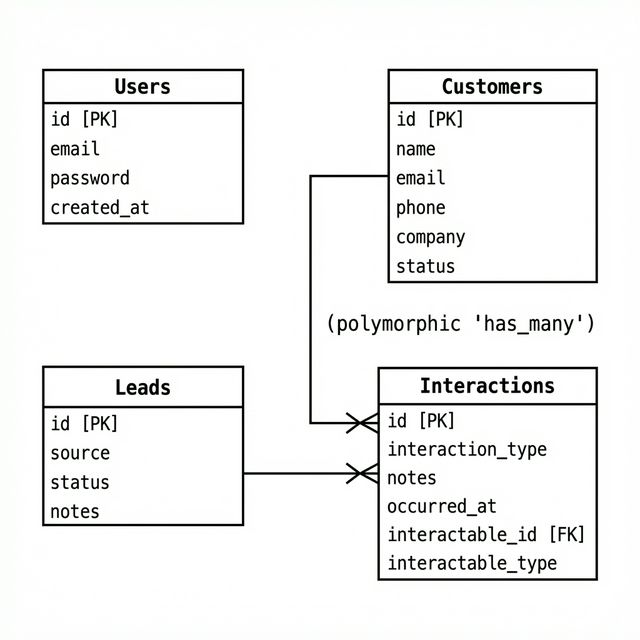

# CRM Rails Application

**Made by codedbyelif**

A full-stack implementation of a Customer Relationship Management (CRM) system using Ruby on Rails, Hotwire (Turbo + Stimulus), and Tailwind CSS.

## Overview

This application serves as a comprehensive tool for managing customer relationships, tracking leads, and recording interactions. It started as an API-only backend and was converted into a full-stack application to provide a modern, responsive web interface.

## Database Schema

The following diagram illustrates the database structure and the relationships between Users, Customers, Leads, and Interactions. Note the polymorphic relationship where both Customers and Leads can have multiple Interactions.



## Features

- **Dashboard**: Real-time overview of metrics and recent activity.
- **Customer Management**: Full CRUD operations for managing customer data.
- **Lead Tracking**: Track potential customers through various statuses (New, Contacted, Won, Lost).
- **Interaction Logging**: Record calls, emails, and meetings. Interactions are polymorphically associated with either Customers or Leads.
- **Secure Authentication**: Built with Devise for robust user session management.
- **Modern UI**: Designed with Tailwind CSS, featuring a responsive layout and a premium red-themed aesthetic.
- **Hotwire Integration**: Uses Turbo Drive and Frames for a fast, single-page application feel without complex JavaScript frameworks.

## Prerequisites

Ensure you have the following installed on your system:

- **Ruby**: Version 3.4.8 (managed via rbenv or rvm)
- **Rails**: Version 8.1.2
- **SQLite3**: Default database for development.

## Installation

1.  **Clone the repository:**
    ```bash
    git clone <repository_url>
    cd crm-rails
    ```

2.  **Install Ruby dependencies:**
    ```bash
    bundle install
    ```

3.  **Install Foreman (Required for running the app):**
    ```bash
    gem install foreman
    ```

4.  **Setup the database:**
    ```bash
    bin/rails db:setup
    ```

## Usage

To start the application, run the development script. This command uses Foreman to start both the Rails server and the Tailwind CSS file watcher simultaneously.

```bash
./bin/dev
```

Open your browser and navigate to:
[http://localhost:3000](http://localhost:3000)

### Initial Login
You can register a new user or use the seed data if available.

## Project Structure

A detailed overview of the meaningful files and directories in this project:

- **app/**
    - **controllers/**: Ruby classes handling the request/response cycle.
        - **api/v1/**: Controllers for JSON API endpoints, versioned for stability.
        - **devise/**: Custom controllers overriding default Devise behavior.
        - `application_controller.rb`: Base controller all others inherit from.
        - `dashboard_controller.rb`: Handles the main dashboard logic.
    - **models/**: Active Record models representing database tables (User, Customer, Lead, Interaction).
    - **views/**: ERB templates for rendering HTML.
        - **customers/**: Forms and lists for customer management.
        - **leads/**: Forms and lists for lead tracking.
        - **interactions/**: Forms and lists for interaction logging.
        - **layouts/**: `application.html.erb` defines the base HTML structure.
        - **shared/**: Reusable partials like `_navbar.html.erb`.
    - **javascript/**: Stimulus controllers and other frontend logic.
    - **assets/**:
        - **stylesheets/**: Main CSS files (Tailwind imports).
        - **images/**: Static images.

- **config/**
    - `routes.rb`: The central routing file defining URL mappings to controllers.
    - `database.yml`: Database connection settings.
    - `tailwind.config.js`: Configuration for Tailwind CSS customization (colors, fonts).

- **db/**
    - **migrate/**: Migration files to modify the database schema over time.
    - `schema.rb`: The authoritative representation of the current database state.
    - `seeds.rb`: Script to populate the database with initial data.

- **public/**: Static files served directly by the web server (e.g., this database schema image).
- **bin/**: Executable scripts (rails, rake, bundle, dev).
- `Procfile.dev`: Configuration for Foreman to run web and css processes together.

## Tech Stack

- **Backend**: Ruby on Rails 8
- **Frontend**: Hotwire (Turbo, Stimulus), Tailwind CSS
- **Database**: SQLite
- **Authentication**: Devise
- **Asset Management**: Propshaft

## License

This project is open-source and available for use and modification.

---

# CRM Rails Uygulaması (Turkish)

**codedbyelif tarafından yapılmıştır**

Ruby on Rails, Hotwire (Turbo + Stimulus) ve Tailwind CSS kullanılarak geliştirilmiş tam kapsamlı bir Müşteri İlişkileri Yönetimi (CRM) sistemi uygulaması.

## Genel Bakış

Bu uygulama, müşteri ilişkilerini yönetmek, potansiyel müşterileri (leads) takip etmek ve etkileşimleri (aramalar, toplantılar vb.) kaydetmek için kapsamlı bir araç olarak hizmet eder. Başlangıçta sadece API tabanlı bir arka uç olarak tasarlanmış, daha sonra modern ve duyarlı bir web arayüzü sunmak üzere tam kapsamlı (full-stack) bir uygulamaya dönüştürülmüştür.

## Veritabanı Şeması

Aşağıdaki şema, Kullanıcılar (Users), Müşteriler (Customers), İpuçları (Leads) ve Etkileşimler (Interactions) arasındaki veritabanı yapısını ve ilişkileri göstermektedir. Hem Müşterilerin hem de İpuçlarının birden fazla Etkileşime sahip olabildiği polimorfik ilişkiye dikkat edin.


## Özellikler

- **Dashboard (Kontrol Paneli)**: Metriklerin ve son aktivitelerin gerçek zamanlı genel görünümü.
- **Müşteri Yönetimi**: Müşteri verilerini yönetmek için tam CRUD (Ekleme, Okuma, Güncelleme, Silme) işlemleri.
- **İpucu Takibi**: Potansiyel müşterileri çeşitli durumlar (Yeni, İletişime Geçildi, Kazanıldı, Kaybedildi) üzerinden takip etme.
- **Etkileşim Kaydı**: Aramaları, e-postaları ve toplantıları kaydetme. Etkileşimler, polimorfik olarak Müşteriler veya İpuçları ile ilişkilendirilir.
- **Güvenli Kimlik Doğrulama**: Güçlü kullanıcı oturum yönetimi için Devise ile oluşturulmuştur.
- **Modern Arayüz**: Tailwind CSS ile tasarlanmış, duyarlı bir düzen ve premium kırmızı temalı estetik.
- **Hotwire Entegrasyonu**: Karmaşık JavaScript çerçeveleri olmadan hızlı, tek sayfalı uygulama hissi için Turbo Drive ve Frames kullanır.

## Ön Gereksinimler

Sisteminizde aşağıdakilerin yüklü olduğundan emin olun:

- **Ruby**: Sürüm 3.4.8 (rbenv veya rvm ile yönetilir)
- **Rails**: Sürüm 8.1.2
- **SQLite3**: Geliştirme ortamı için varsayılan veritabanı.

## Kurulum

1.  **Depoyu (Repository) klonlayın:**
    ```bash
    git clone <repository_url>
    cd crm-rails
    ```

2.  **Ruby bağımlılıklarını yükleyin:**
    ```bash
    bundle install
    ```

3.  **Foreman'i yükleyin (Uygulamayı çalıştırmak için gereklidir):**
    ```bash
    gem install foreman
    ```

4.  **Veritabanını kurun:**
    ```bash
    bin/rails db:setup
    ```

## Kullanım

Uygulamayı başlatmak için geliştirme komut dosyasını çalıştırın. Bu komut, Foreman kullanarak hem Rails sunucusunu hem de Tailwind CSS dosya izleyicisini aynı anda başlatır.

```bash
./bin/dev
```

Tarayıcınızı açın ve şu adrese gidin:
[http://localhost:3000](http://localhost:3000)

### İlk Giriş
Yeni bir kullanıcı kaydı oluşturabilir veya varsa hazır verileri (seed data) kullanabilirsiniz.

## Proje Yapısı

Projedeki önemli dosya ve dizinlerin detaylı özeti:

- **app/**
    - **controllers/**: İstek/yanıt döngüsünü yöneten Ruby sınıfları.
        - **api/v1/**: JSON API uç noktaları için kararlılık sağlayan versiyonlu kontrolcüler.
        - **devise/**: Varsayılan Devise davranışını değiştiren özel kontrolcüler.
        - `application_controller.rb`: Diğer tüm kontrolcülerin miras aldığı temel kontrolcü.
        - `dashboard_controller.rb`: Ana kontrol paneli mantığını yönetir.
    - **models/**: Veritabanı tablolarını temsil eden Active Record modelleri (User, Customer, Lead, Interaction).
    - **views/**: HTML oluşturmak için kullanılan ERB şablonları.
        - **customers/**: Müşteri yönetimi için formlar ve listeler.
        - **leads/**: İpucu takibi için formlar ve listeler.
        - **interactions/**: Etkileşim kaydı için formlar ve listeler.
        - **layouts/**: `application.html.erb` temel HTML yapısını tanımlar.
        - **shared/**: `_navbar.html.erb` gibi tekrar kullanılabilir parçalar.
    - **javascript/**: Stimulus kontrolcüleri ve diğer ön uç mantığı.
    - **assets/**:
        - **stylesheets/**: Ana CSS dosyaları (Tailwind yapılandırmaları).
        - **images/**: Statik görseller.

- **config/**
    - `routes.rb`: URL eşleşmelerini tanımlayan merkezi yönlendirme dosyası.
    - `database.yml`: Veritabanı bağlantı ayarları.
    - `tailwind.config.js`: Tailwind CSS özelleştirmeleri (renkler, fontlar) için yapılandırma dosyası.

- **db/**
    - **migrate/**: Veritabanı şemasını zaman içinde değiştirmek için kullanılan göç dosyaları.
    - `schema.rb`: Veritabanının mevcut durumunun yetkili temsili.
    - `seeds.rb`: Veritabanını başlangıç verileriyle doldurmak için kullanılan komut dosyası.

- **public/**: Web sunucusu tarafından doğrudan sunulan statik dosyalar (örneğin, bu veritabanı şema görseli).
- **bin/**: Çalıştırılabilir komut dosyaları (rails, rake, bundle, dev).
- `Procfile.dev`: Foreman'in web ve css işlemlerini birlikte çalıştırması için yapılandırma dosyası.

## Teknoloji Yığını

- **Backend**: Ruby on Rails 8
- **Frontend**: Hotwire (Turbo, Stimulus), Tailwind CSS
- **Veritabanı**: SQLite
- **Kimlik Doğrulama**: Devise
- **Varlık Yönetimi**: Propshaft

## Lisans

Bu proje açık kaynaktır ve kullanım ile değişiklik için uygundur.
